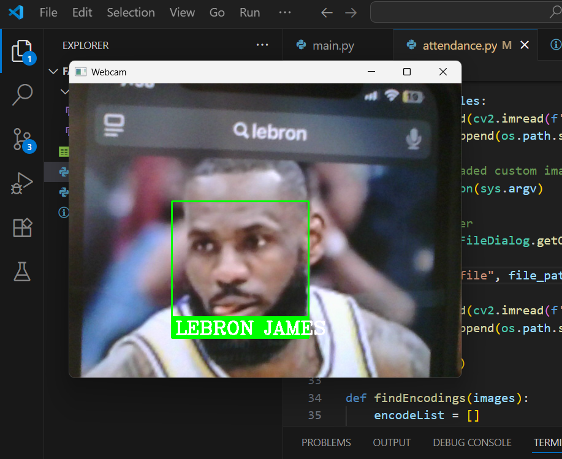

# Face Recognition

Simple face recognition program written in python, using the face_recognition library (https://github.com/ageitgey/face_recognition). Able to read faces from webcam and compare them to all faces in the images folder and identify any matches, and track attendance.




## Installation

1. Clone the repository:

```bash
git clone https://github.com/sweetbix/facerecognition.git
cd facerecognition
```

2. Install project dependencies:

```bash
pip install -r requirements.txt
```

3. Add known faces:

- Upload images of people you want to recognise into the images/ folder.
- Use clear front-facing images.
- File names (e.g. john.png) will be displayed


Also make sure your webcam is turned on!


## Usage

```bash
python attendance.py
```