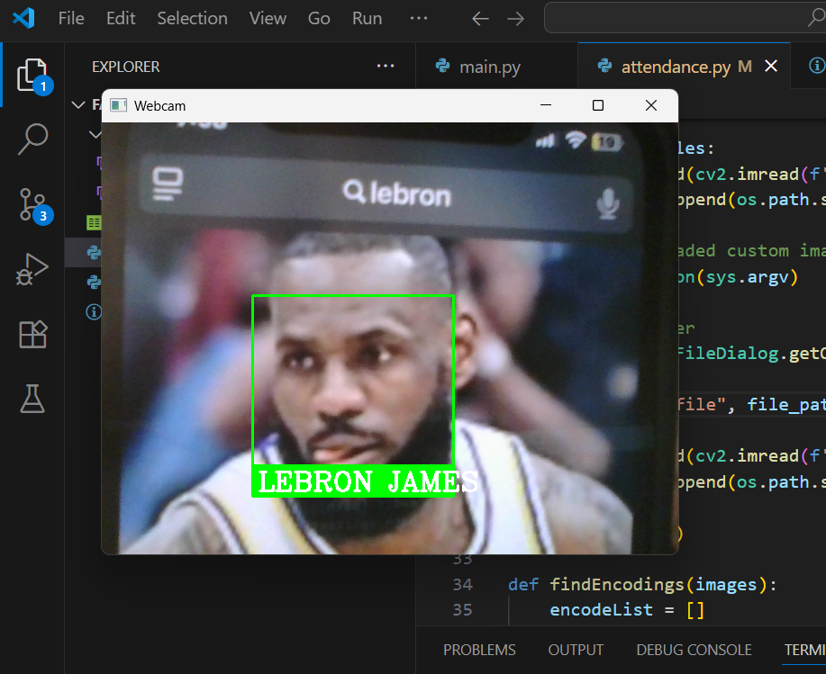

# Face Recognition

Simple face recognition program written in python, using the face_recognition library (https://github.com/ageitgey/face_recognition). Able to read faces from webcam and compare them to all faces in the images folder and identify any matches, and track attendance.




## Installation

### 1. Clone the repository:

```bash
git clone https://github.com/sweetbix/facerecognition.git
cd facerecognition
```

### 2. Install project dependencies:

```bash
pip install -r requirements.txt
```

#### ⚠️ Windows Setup Note

If you're on Windows, you may need to install:

👉 [Visual Studio](https://visualstudio.microsoft.com/downloads/)

Make sure to check:
- ✅ "Desktop development with C++"

This is required for installing `dlib`, which powers face detection.


### 3. Add known faces:

- Upload images of people you want to recognise into the images/ folder.
- Use clear front-facing images.
- File names (e.g. john.png) will be displayed


Also make sure your webcam is turned on!


## Usage

```bash
python attendance.py
```

---

## Web app (fullstack)

Live webcam recognition, known-face management, and attendance logging via **FastAPI** + **React (Vite)**. Known faces are stored under `backend/storage/known_faces/` (seeded from `images/` the first time the server starts if that folder is empty). Attendance is stored in `backend/data.db` (SQLite), one row per person per UTC calendar day.

### Prerequisites

- Same Python deps as the CLI (including **dlib** / Visual Studio C++ on Windows — see above).
- **Node.js 20+** and npm for the frontend.

### 1. Backend

From the `backend/` directory:

```bash
cd backend
pip install -r requirements.txt
uvicorn app.main:app --reload --host 127.0.0.1 --port 8000
```

Optional environment variables:

| Variable | Default | Purpose |
|----------|---------|---------|
| `FACE_TOLERANCE` | `0.5` | `face_recognition.compare_faces` tolerance |
| `CORS_ORIGINS` | `http://localhost:5173` | Comma-separated allowed browser origins |

### 2. Frontend

In a second terminal, from `frontend/`:

```bash
cd frontend
npm install
npm run dev
```

Open **http://localhost:5173**. The dev server proxies `/api` and `/ws` to the backend on port **8000**.

- **Live** — Start the camera; JPEG frames are sent over a WebSocket to `/ws/recognize`. Matches are drawn on the video and logged to attendance (deduplicated per UTC day).
- **Faces** — Upload or delete known faces (exactly one face per image).
- **Attendance** — View or clear the log.

For production, build the frontend (`npm run build`) and serve `frontend/dist` with any static host, configuring CORS and API/WebSocket URLs accordingly.